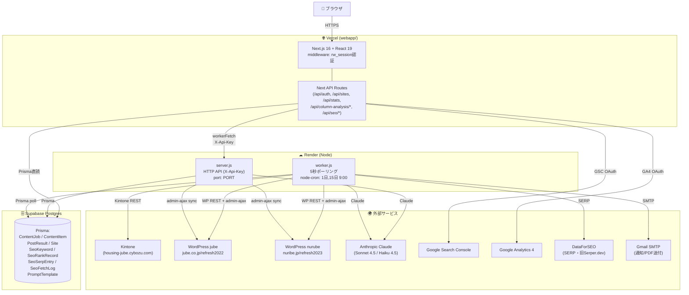
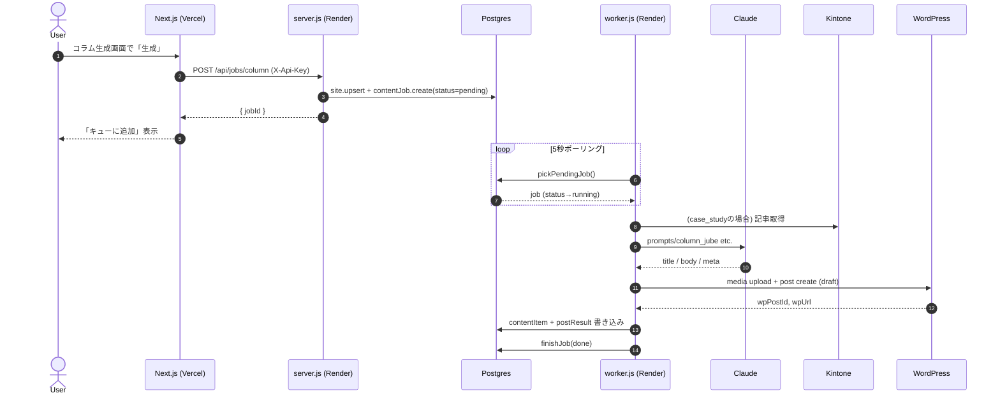
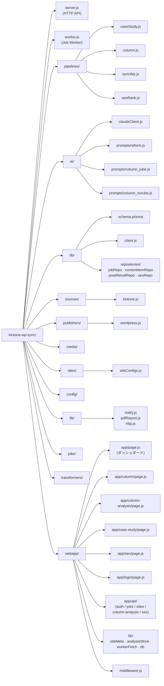
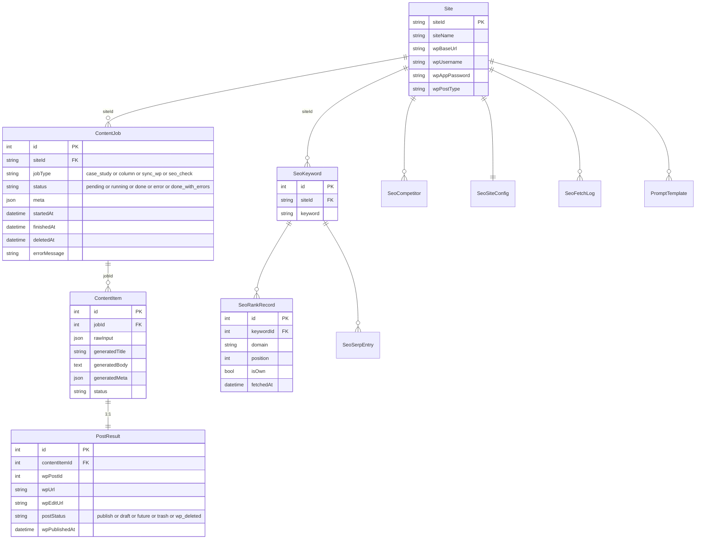
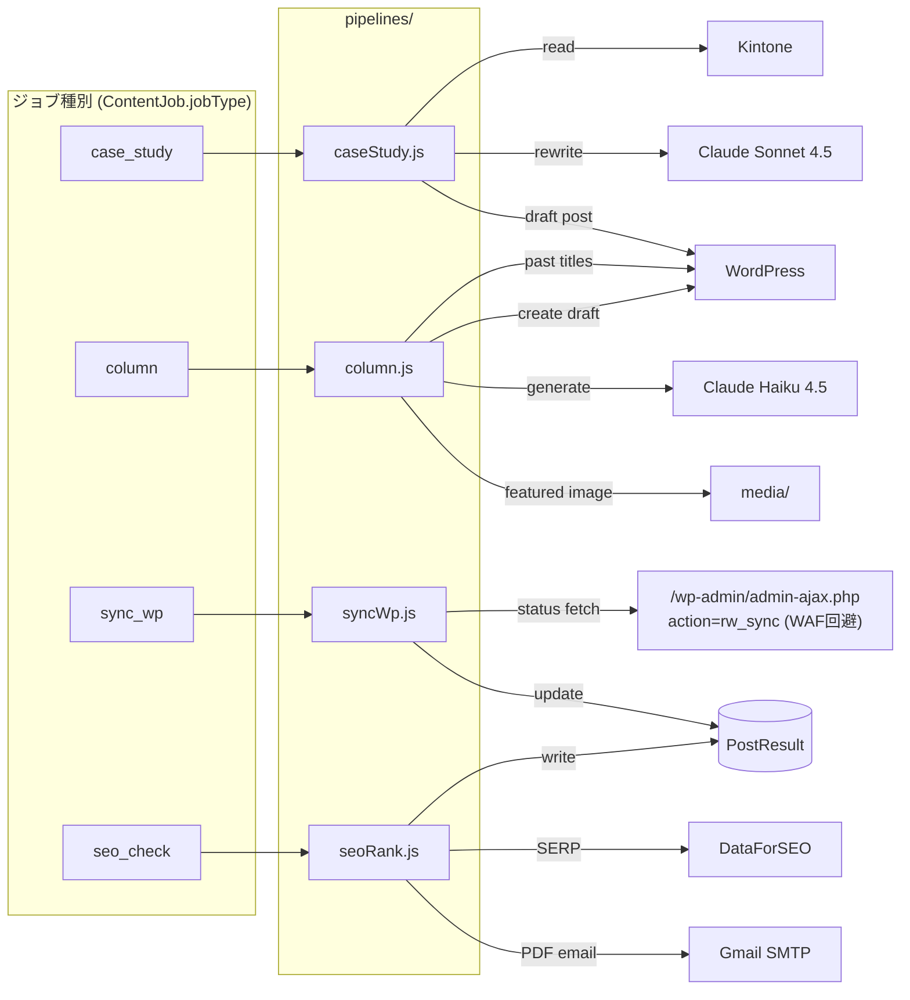
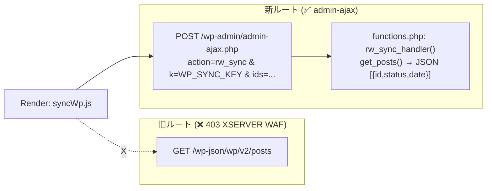
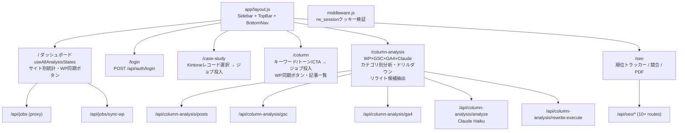
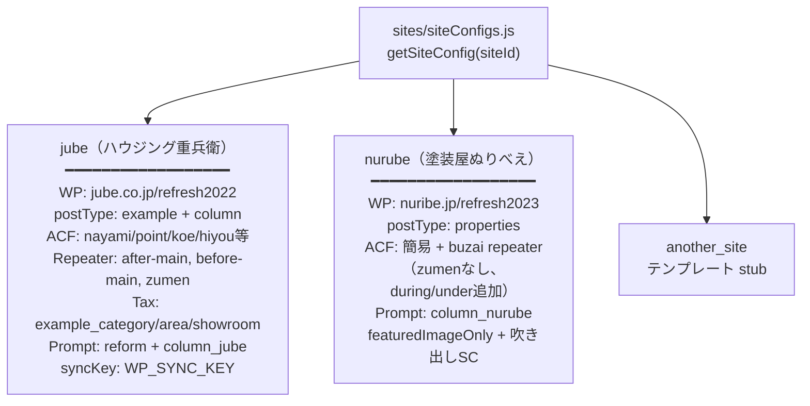
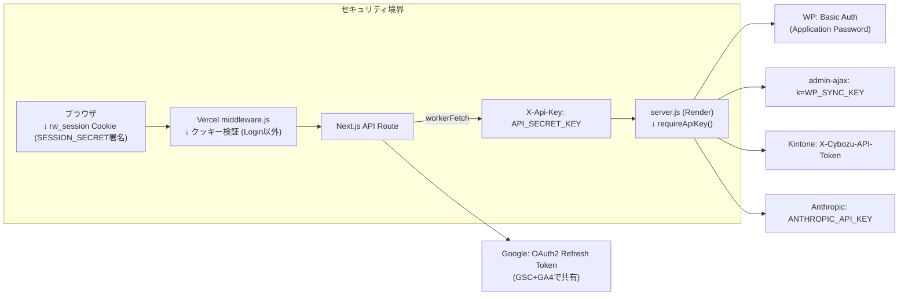

# kintone-wp-sync アーキテクチャ全体図

> 最終更新: 2026-05-11

---

## 1. システム全体像（プロセス×ホスティング）



---

## 2. ジョブのライフサイクル（pending → done）



---

## 3. ディレクトリ構成（リポジトリレベル）



---

## 4. DBスキーマ（ER図）



---

## 5. ジョブ種別 × パイプライン × 外部I/O



---

## 6. WordPress 同期：WAF回避ルート



---

## 7. フロントエンド（Next.js 16）のページマップ



---

## 8. サイト設定（マルチテナント）



---

## 9. 認証・通信フロー



---

## 10. データの流れ（コラム生成→公開→分析）

```mermaid
flowchart TB
  U["👤 ユーザー<br/>キーワード入力"] -->|POST /api/jobs/column| Q[("Postgres<br/>ContentJob.pending")]
  Q -->|5秒poll| WK["worker.js"]
  WK -->|過去タイトル取得| WPGet["WP: 既存記事一覧"]
  WK -->|prompt+context| CL["Claude Haiku 4.5"]
  CL -->|title/body/meta/タグ| WK
  WK -->|画像生成 (media/)| IMG["Featured Image"]
  WK -->|POST + Featured Image| WP["WordPress 下書き"]
  WP -->|wpPostId| WK
  WK --> CI["ContentItem<br/>+ PostResult (draft)"]

  WP -. WP管理画面で公開 .-> WPPub["status: publish"]
  U2["👤 WP同期ボタン"] -->|POST /api/jobs/sync-wp<br/>同期実行| SYNC["syncWp.js<br/>admin-ajax"]
  SYNC -->|status更新| CI

  CI -->|分析画面| ANL["/column-analysis"]
  ANL --> GSC["GSC: 順位/CTR/クリック"]
  ANL --> GA4["GA4: セッション/直帰率"]
  ANL --> CL2["Claude: カテゴリ分類<br/>+ リライト候補"]
  ANL --> UI["UIに表示<br/>カテゴリ別 + ドリルダウン"]
```

---

## ポイント整理（迷ったときの早見表）

| 観点 | 実装 |
|---|---|
| **ジョブキュー** | Redis/BullMQ ではなく **Postgresの `status='pending'` 行**。`worker.js` が5秒ポーリング |
| **シングルワーカー** | `isProcessing` フラグで同時実行1ジョブ。複数Render workerの想定なし |
| **Render側で実行する理由** | XSERVER WAF が Vercel の海外IPを弾く（WP同期・WP REST）。Renderは固定IPが日本寄り |
| **Vercelで実行する理由** | GSC/GA4/Prisma直読・UIホスティング。OAuth Refresh Tokenを安全に保持 |
| **AIプロバイダ** | Anthropic Claudeのみ（OpenAI/Geminiは未使用） |
| **WP状態同期** | `/wp-json/` ❌ → `admin-ajax.php?action=rw_sync` ✅（functions.php に handler 追加が必須） |
| **SEO自動実行** | `node-cron` で毎月1日・15日の9:00（Asia/Tokyo）にSEO順位チェック → PDFメール |
| **prismaクライアント** | 2箇所（`db/schema.prisma` + `webapp/prisma/schema.prisma`）。スキーマ差異に注意 |
| **認証** | Webapp: `rw_session` Cookie（SESSION_SECRET署名） / API: `X-Api-Key` ヘッダ |
| **コラム分析** | Vercel側がGSC/GA4/WP記事を取得 → Claude Haikuでカテゴリ分類・リライト候補抽出 |
| **Kintoneは事例のみ** | Kintone連携は `case_study` ジョブのみ。コラム生成にKintoneは不使用 |
| **今月コラム数** | `buildCategoryStats` が post.date の先頭7文字でYYYY-MM比較してカウント |

---

## 環境変数一覧

| 変数名 | 用途 | 設定場所 |
|---|---|---|
| `DATABASE_URL` | Supabase Postgres (pooled) | Render + Vercel |
| `DIRECT_URL` | Supabase Postgres (direct) | Render + Vercel |
| `API_SECRET_KEY` | Vercel→Render 認証ヘッダ | Render + Vercel |
| `ALLOWED_ORIGIN` | CORS許可オリジン (Vercel URL) | Render |
| `SESSION_SECRET` | rw_session Cookie署名 | Vercel |
| `ANTHROPIC_API_KEY` | Claude API | Render + Vercel |
| `WP_SYNC_KEY` | admin-ajax rw_sync 認証キー | Render |
| `JUBE_KINTONE_API_TOKEN` | Kintone jube | Render |
| `NURUBE_KINTONE_APP_ID` | Kintone nurube AppID (513) | Render |
| `GSC_CLIENT_ID` | Google OAuth クライアントID | Vercel |
| `GSC_CLIENT_SECRET` | Google OAuth クライアントSecret | Vercel |
| `GSC_REFRESH_TOKEN` | Google OAuth RefreshToken | Vercel |
| `GSC_SITE_URL_JUBE` | GSCプロパティURL (jube) | Vercel |
| `GSC_SITE_URL_NURUBE` | GSCプロパティURL (nurube) | Vercel |
| `DATAFORSEO_LOGIN` | DataForSEO SERP API ログイン | Render |
| `DATAFORSEO_PASSWORD` | DataForSEO SERP API パスワード | Render |
| `SERPER_API_KEY` | (旧) Serper.dev SERP API・DataForSEO未設定時のフォールバック | Render |
| `WORKER_API_URL` | Render server.js の URL | Vercel |
| `POLL_INTERVAL_MS` | worker polling間隔 (default 5000) | Render |
